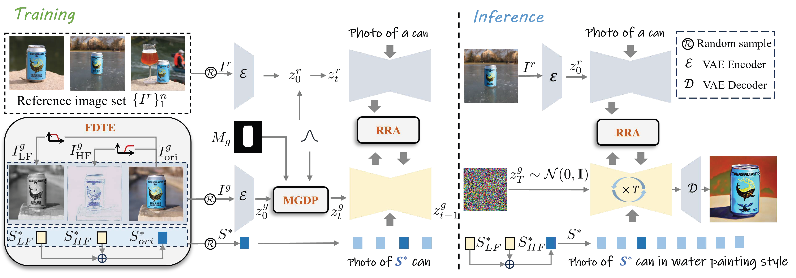
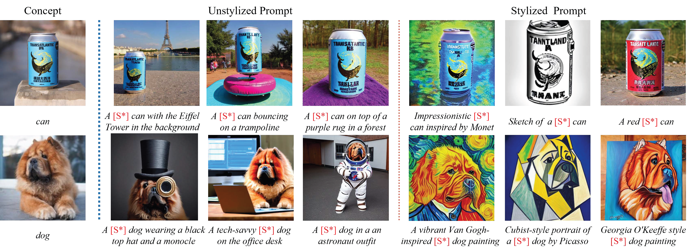

# ___***Equilibrated Diffusion:Frequency-aware Textual Embedding for Equilibrated Image Customization [ACMMM2024 Oral]***___

<a href='https://maple-aigc.github.io/EqDiff/'></a> 
<a href='https://openreview.net/pdf?id=ERuypCHYvX'></a> 


---
## Introduction

Image customization involves learning the subject from provided concept images and generating it within textual contexts, typically yielding alterations of attributes such as style or background. 
Prevailing methods primarily rely on fine-tuning technique, wherein a unified latent embedding is employed to characterize various concept attributes. 
However, the attribute entanglement renders customized result challenging to mitigate the influence of subject-irrelevant attributes (e.g., style and background).
To overcome these issues, we propose Equilibrated Diffusion, an innovative method that achieves equilibrated image customization by decoupling entangled concept attributes from a frequency-aware perspective, thus harmonizing textual and visual consistency.
Unlike conventional approaches that employ a shared latent embedding and tuning process to learn concept, our Equilibrated Diffusion draws inspiration from the correlation between high- and low-frequency components with image style and content, decomposing concept accordingly in the frequency domain. 
Through independently optimizing concept embeddings in the frequency domain, the denoising model not only enriches its comprehension of style attribute irrelevant to subject identity but also inherently augments its aptitude for accommodating novel stylized descriptions.
Furthermore, by combining different frequency embeddings, our model retains the spatially original customization capability. 
We further design a diffusion process guided by subject masks to alleviate the influence of background attribute, thereby strengthening text alignment.
To ensure subject-related information consistency, Residual Reference Attention (RRA) is incorporated into the denoising model of spatial attention computation, effectively preserving structural details. 
Experimental results demonstrate that Equilibrated Diffusion surpasses other competitors with better subject consistency while closely adhering to text descriptions, thus validating the superiority of our approach.




## Release
- [2024/8/21] 🔥 We release the training and inference code.

## Results
Our customization results are based on stable-diffusion-v1-5 model including stylized and non-stylized prompts.


## Getting Started

```
# install diffusers
pip install diffusers==0.21.4
# install other dependencies
pip install -r requirements.txt
# Download the stable-diffusion-v1-5 
git clone https://huggingface.co/runwayml/stable-diffusion-v1-5
```

## How to Train
For training, you should install [accelerate](https://github.com/huggingface/accelerate) and prepare your own 3 to 4 images of customization subjects into a folder.

```
bash scripts/train.sh
```

## How to Test
```
bash scripts/test.sh
```

## Citation
If you find Eq-Diff useful for your research and applications, please cite using this BibTeX:
```bibtex
@inproceedings{ma2024equilibrated,
  title={Equilibrated Diffusion: Frequency-aware Textual Embedding for Equilibrated Image Customization},
  author={Ma, Liyuan and Fang, Xueji and Qi, Guo-Jun},
  booktitle={ACM Multimedia 2024}
}
```